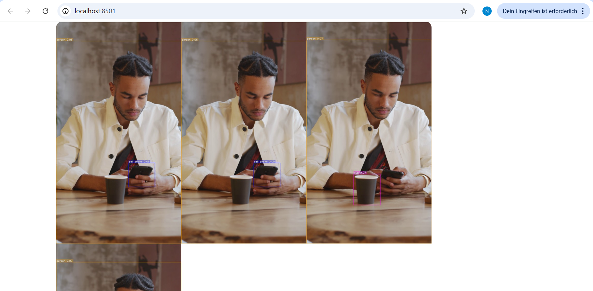
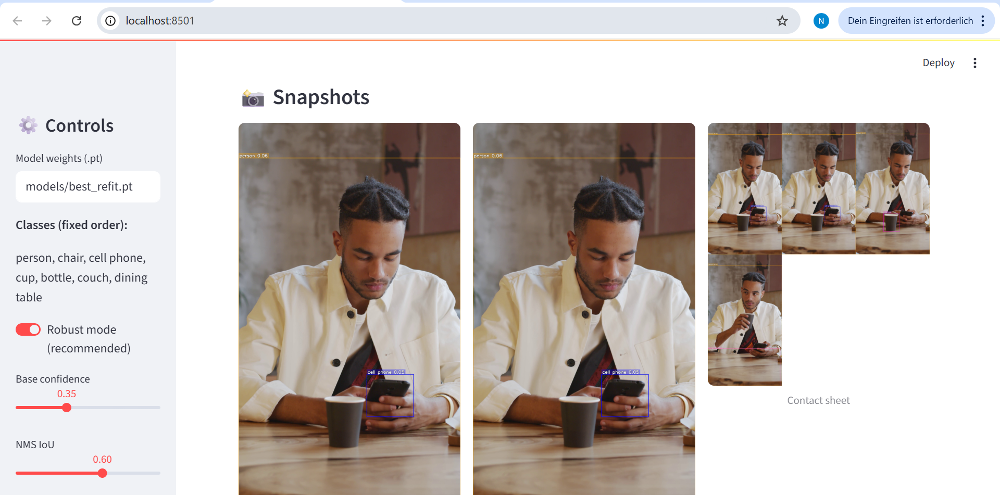
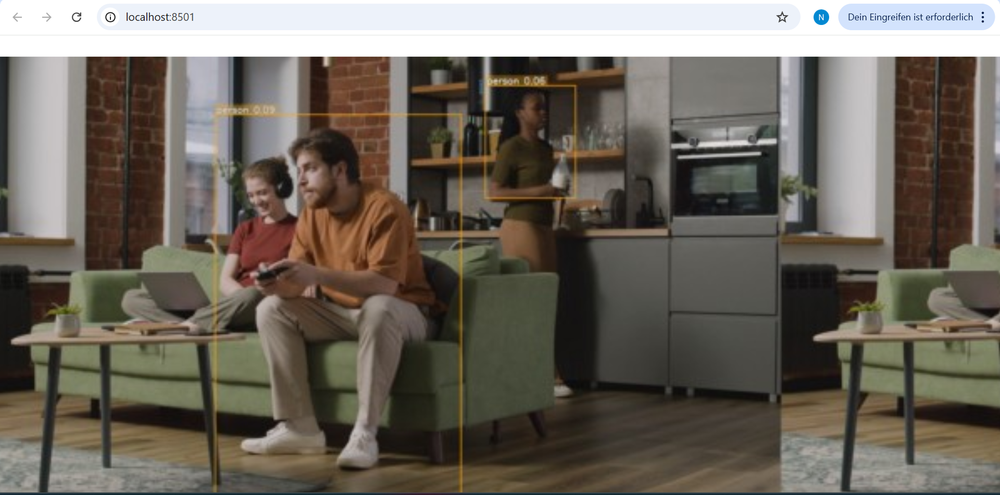
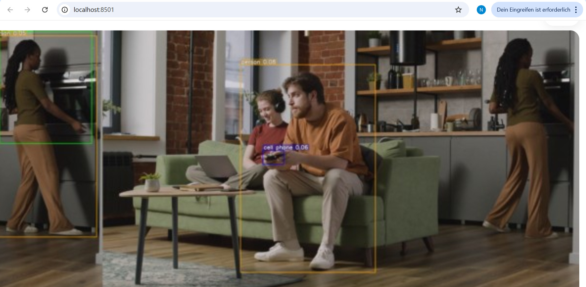
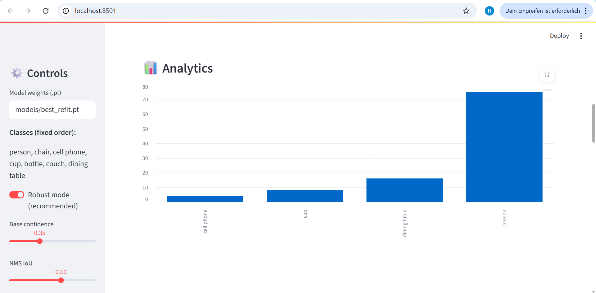
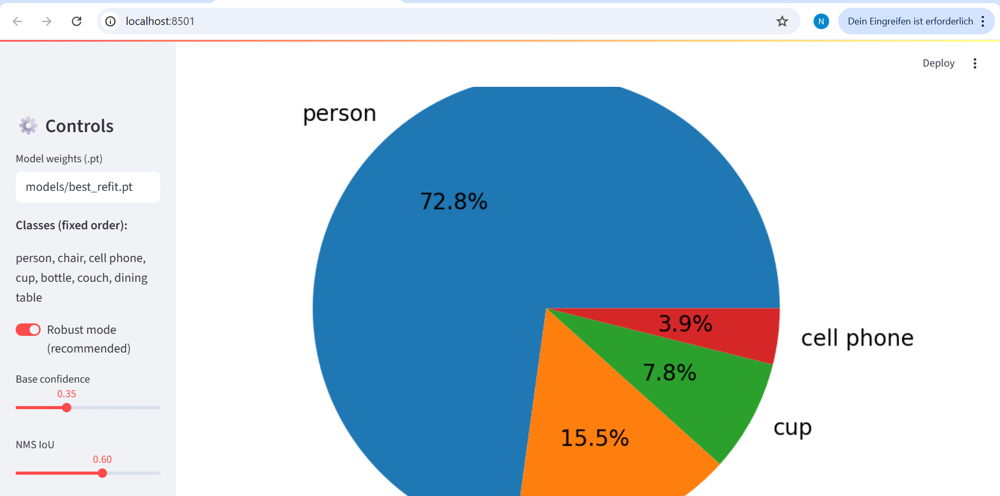
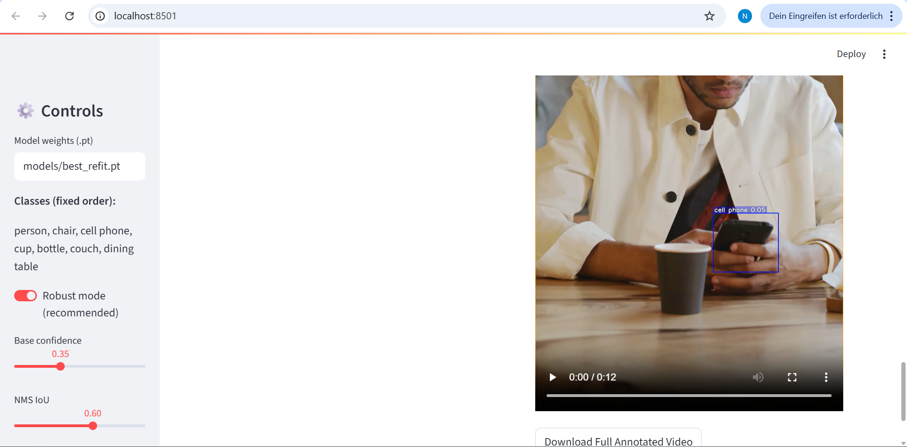
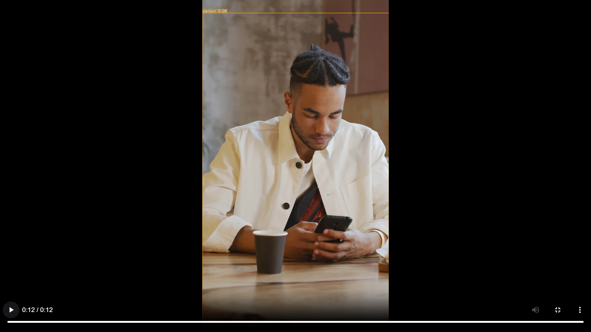

# 🧠 Realtime Object Analytics (YOLOv8 + Streamlit)

> Interactive web app for **real-time detection and analysis** of common indoor objects.  
> **Detected Classes:** person, chair, cell phone, cup, bottle, couch, dining table  

<p align="left">
  
  
  
</p>

---

## 🚀 Quickstart

```bash
# 1️⃣ Create and activate environment
python -m venv .venv
.\.venv\Scripts\activate

# 2️⃣ Install dependencies
pip install -r requirements.txt

# 3️⃣ Run the Streamlit app
streamlit run src/app_streamlit.py --server.port 8501
````

---

## 📁 Project Structure

| Folder / File            | Description                    |
| ------------------------ | ------------------------------ |
| `models/best_refit.pt`   | Main fine-tuned YOLOv8 weights |
| `models/best1.pt`        | Earlier optional model         |
| `src/app_streamlit.py`   | Main Streamlit interface       |
| `test_images/`           | Sample test images             |
| `videos/`                | Optional demo clips            |
| `room_train_as_val.yaml` | Dataset reference file         |
| `requirements.txt`       | Dependencies list              |

---

## 🧩 Features

* ✅ Real-time object detection using YOLOv8
* ✅ Streamlit dashboard for image, video, and webcam input
* ✅ Automatic snapshots and CSV logging
* ✅ Lightweight analytics per detected class
* ✅ Adaptive brightness normalization
* ✅ Sidebar controls for filtering and performance modes

---

## ⚙️ How It Works

1. **Input:** User uploads image/video or enables webcam.
2. **Detection:** YOLOv8 model (`best_refit.pt`) runs inference in real time.
3. **Post-Processing:** Confidence filtering, normalization, and analytics logging.
4. **Analytics:** Summaries stored (CSV) with per-class counts and timestamps.
5. **Display:** Streamlit dashboard shows annotated frames and detection stats.

---

## 📈 Model Information

| Property           | Details                                              |
| ------------------ | ---------------------------------------------------- |
| **Model Name**     | `best_refit.pt`                                      |
| **Base Framework** | YOLOv8 (Ultralytics)                                 |
| **Classes**        | 7 indoor classes                                     |
| **Dataset**        | Custom room-based dataset                            |
| **Use Case**       | Indoor analytics, robotics, HRI, and CV applications |

---

## 🧰 Tech Stack

| Category       | Tools / Libraries                  |
| -------------- | ---------------------------------- |
| **Language**   | Python 3.10 – 3.13                 |
| **Frameworks** | Streamlit, Ultralytics YOLOv8      |
| **Utilities**  | OpenCV, Pillow, Pandas, Matplotlib |

---

Perfect 👍 I see your screenshot names clearly.
Let’s now create the **📸 Demo Preview** section for your `README.md` that matches your actual files inside `images/`.

Here’s the ready-to-paste code block 👇

---

```markdown
## 📸 Demo Preview

### 🖥️ App Dashboard
| Dashboard Up | Dashboard Run | Dashboard Down |
|:-------------:|:--------------:|:---------------:|
|  |  |  |

---

### 🎬 Detection Demos
| Demo 1.1 | Demo 1.2 |
|:--------:|:---------:|
|  |  |

| Demo 2.1 | Demo 2.2 |
|:--------:|:---------:|
|  |  |

---

### 📊 Analytics Overview
| Bar Chart | Pie Chart |
|:----------:|:----------:|
|  |  |

| Analytics Table | Annotated Video |
|:----------------:|:----------------:|
|  |  |
```


Perfect 👍 I see your screenshot names clearly.
Let’s now create the **📸 Demo Preview** section for your `README.md` that matches your actual files inside `images/`.

Here’s the ready-to-paste code block 👇

---

```markdown
## 📸 Demo Preview

### 🖥️ App Dashboard
| Dashboard Up | Dashboard Run | Dashboard Down |
|:-------------:|:--------------:|:---------------:|
|  |  |  |

---

### 🎬 Detection Demos
| Demo 1.1 | Demo 1.2 |
|:--------:|:---------:|
|  |  |

| Demo 2.1 | Demo 2.2 |
|:--------:|:---------:|
|  |  |

---

### 📊 Analytics Overview
| Bar Chart | Pie Chart |
|:----------:|:----------:|
|  |  |

| Analytics Table | Annotated Video |
|:----------------:|:----------------:|
|  |  |
```

---

## 🌟 Future Add-ons

* 🔧 **Performance Presets** – Quick toggle between Speed / Balanced / Quality
* 🖼️ **Hybrid Snapshots** – Combine contact sheet + configurable frame captures
* ⏱️ **Frame Pacing Control** – Adjustable delay per frame (e.g., 20 ms)
* 🧠 **Grad-CAM Visualization** – Explain model predictions visually
* ⚡ **Performance Optimization** – FPS benchmarking, ONNX/quantized export
* 🤖 **Domain Adaptations** – Extend model for medical, robotics, and gesture datasets
* 📊 **Auto-Generated Reports** – Export PDF/CSV analytics summaries with charts

---

