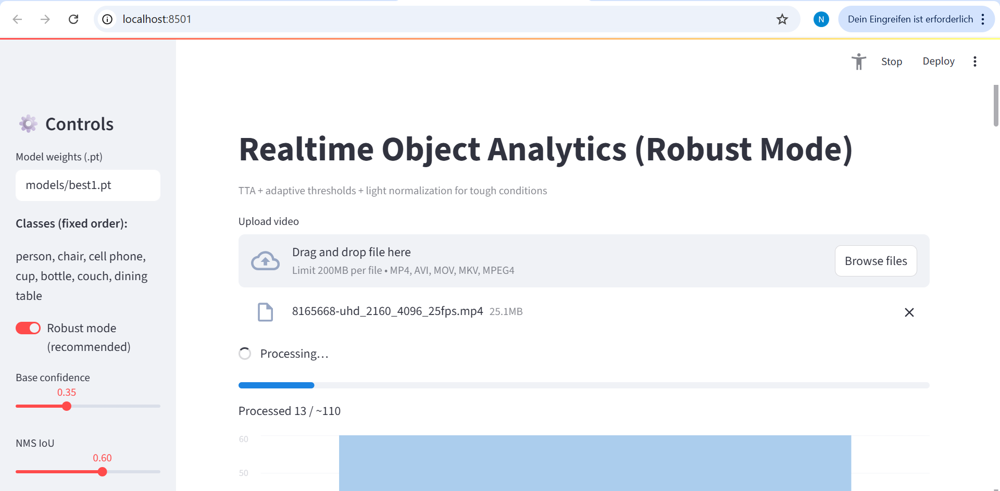
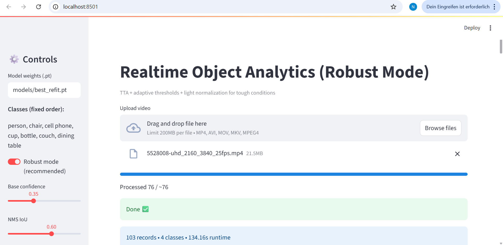
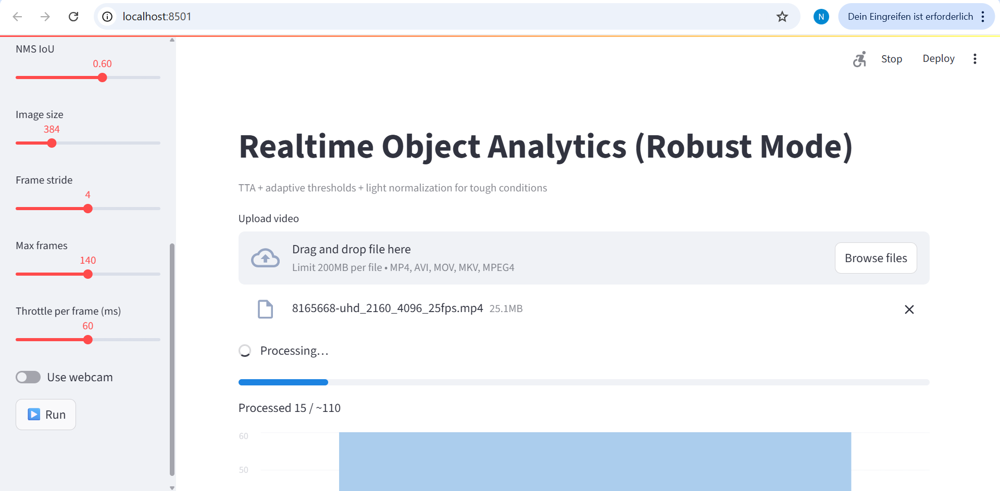

# 🧠 Realtime Object Analytics (YOLOv8 + Streamlit)

> Interactive web app for **real-time detection and analysis** of common indoor objects.  
> **Detected Classes:** person, chair, cell phone, cup, bottle, couch, dining table  

<p align="left">
  
  
  
</p>

---

## 🚀 Quickstart

```bash
# 1️⃣ Create and activate environment
python -m venv .venv
.\.venv\Scripts\activate

# 2️⃣ Install dependencies
pip install -r requirements.txt

# 3️⃣ Run the Streamlit app
streamlit run src/app_streamlit.py --server.port 8501
````

---

## 📁 Project Structure

| Folder / File            | Description                        |
| ------------------------ | ---------------------------------- |
| `models/best1.pt`        | Main YOLOv8 model (custom trained) |
| `models/room_best.pt`    | Alternate model variant            |
| `src/app_streamlit.py`   | Main Streamlit interface           |
| `test_images/`           | Sample test images                 |
| `videos/`                | Optional demo clips                |
| `room_train_as_val.yaml` | Dataset reference file             |
| `requirements.txt`       | Dependencies list                  |

---

## 🧩 Features

✅ Real-time object detection using YOLOv8
✅ Streamlit dashboard for image, video, and webcam input
✅ Automatic snapshots and CSV logging
✅ Lightweight analytics per detected class
✅ Adaptive brightness normalization
✅ Sidebar controls for filtering and performance modes

---

## ⚙️ How It Works

1. **Input:** Upload image/video or enable webcam
2. **Detection:** YOLOv8 (`best1.pt`) runs inference in real time
3. **Post-Processing:** Confidence filtering + normalization
4. **Analytics:** CSV logs with per-class counts & timestamps
5. **Display:** Streamlit dashboard shows annotated frames & stats

---

## 📈 Model Information

| Property           | Details                                              |
| ------------------ | ---------------------------------------------------- |
| **Model Name**     | `best1.pt`                                           |
| **Base Framework** | YOLOv8 (Ultralytics)                                 |
| **Classes**        | 7 indoor classes                                     |
| **Dataset**        | Custom room-based dataset                            |
| **Use Case**       | Indoor analytics, robotics, HRI, and CV applications |

---

## 🧰 Tech Stack

| Category       | Tools / Libraries                  |
| -------------- | ---------------------------------- |
| **Language**   | Python 3.10 – 3.13                 |
| **Frameworks** | Streamlit, Ultralytics YOLOv8      |
| **Utilities**  | OpenCV, Pillow, Pandas, Matplotlib |

---

## 📸 Demo Preview

### 🖥️ App Dashboard

|               Dashboard Up               |                Dashboard Run               |                Dashboard Down                |
| :--------------------------------------: | :----------------------------------------: | :------------------------------------------: |
|  |  |  |

---

### 🎬 Detection Demos

|             Demo 1.1            |             Demo 1.2            |
| :-----------------------------: | :-----------------------------: |
|  |  |

|             Demo 2.1            |             Demo 2.2            |
| :-----------------------------: | :-----------------------------: |
|  |  |

---

### 📊 Analytics Overview

|                  Bar Chart                  |                  Pie Chart                  |
| :-----------------------------------------: | :-----------------------------------------: |
|  |  |

|               Analytics Table               |               Annotated Video               |
| :-----------------------------------------: | :-----------------------------------------: |
|  |  |

---

## 🌟 Future Add-ons

* 🔧 **Performance Presets** – Speed / Balanced / Quality modes
* 🖼️ **Hybrid Snapshots** – Contact sheet + frame captures
* ⏱️ **Frame Pacing Control** – Adjustable delay (e.g., 20 ms)
* 🧠 **Grad-CAM Visualization** – Explain predictions visually
* ⚡ **Performance Optimization** – FPS benchmark, ONNX export
* 🤖 **Domain Adaptations** – Extend to medical, robotics, gestures
* 📊 **Auto Reports** – Export analytics summary (PDF/CSV)

---

